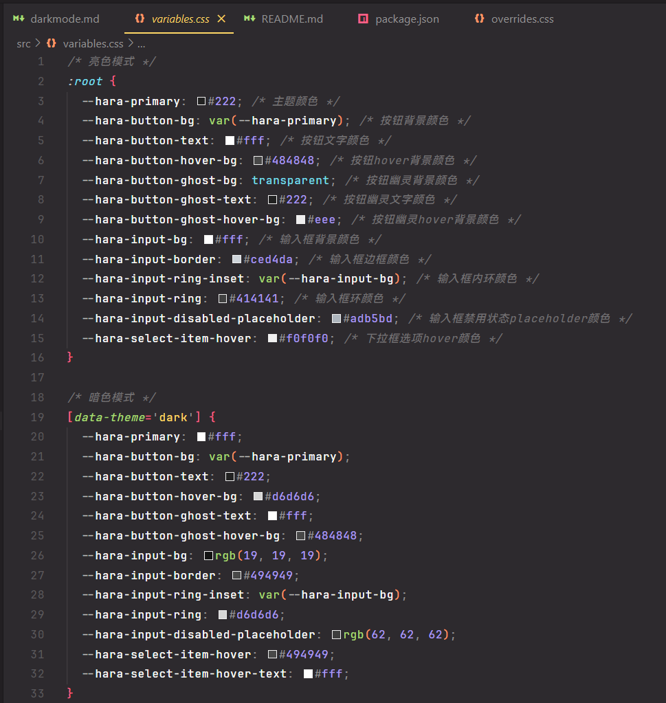

## Tooltip 文字提示
+ 使用 React 中的 `FC<PropsWithChildren<TooltipProps>>` 构建组件基本结构，表示它是一个 React 函数组件，接受的属性包括 TooltipProps 中定义的属性，以及一个可选的 `children` 属性，确保属性类型安全。
+ 组件接收一个位置参数 `position` 设置表示位置的类名，例如 `hara-tooltip-left` 来处理不同方向下组件的样式。
+ 使用 `useState` 钩子监视 `visible` 来管理显示和隐藏的状态，通过 ` onMouseEnter ` 和 ` onMouseLeave ` 鼠标进入和离开的事件处理函数：进入时 `setVisible(true)` / ... 然后根据 visible 的值进行条件渲染判断显示和隐藏


## Select 选择器
因为不只是使用一个组件就可以完成的，所以使用多组件的结构来搓
```html
<Select>
	<SelectTrigger></SelectTrigger>
	<SelectContent>
	    <SelectItem></SelectItem>
	</SelectContent>
</Select>
```
SelectTrigger 用来存放点击触发器中的内容如“选择一个选项”，SelectContent 用来存放各个选项即 SelectItem ，其中通过上下文（`Context`）来管理状态和交互。

其中上下文结构由 `SelectContextProps` 定义，包括是否打开下拉菜单、选中标签和值、切换菜单的打开状态以及选择选项时的回调：
```js
const SelectContext = createContext<SelectContextProps|undefined>(undefined)
```
### SelectTrigger
`SelectTrigger` 组件是下拉菜单的触发器按钮，它使用 `useContext` 来获取上下文，并根据菜单的状态应用不同的样式（选中或者未选中），点击触发器按钮时触发上下文的 `toggleOpen` 函数切换菜单状态，如果后边 **选择了选项则会展示选项内容（组件重新渲染了**

会重新渲染的原因：
选择选项触发的 `onSelect` 中有 `setSelectedValue` 等更新状态的函数，主组件 Select 的状态发生变化的话就会重新渲染真个组件结构包括 trigger ~
### SelectContent
`SelectContent` 组件用于显示下拉菜单的内容，获取上下文根据其中的菜单状态选择是否展示选项
### SelectItem
`SelectItem` 组件表示下拉菜单中的一个选项，获取上下文根据选项是否被选中展示不同的样式（勾勾）点击选项时触发上下文的 `onSelect` 选择该选项，并根据使用 `Select` 组件时是否定义了 `onChange` 来处理选择的选项内容~

### 使用 createPortal 来实现模态框等组件
`Portal` 是 React 提供的一种机制，用于将子组件渲染到父组件 DOM 层次结构之外的 DOM 节点中。它通常用于实现模态框 (modal)、提示框 (tooltip) 或通知等需要在视觉上脱离当前组件层次结构的 UI 元素。

需要注意的是它只改变 DOM 节点的所处位置。在其他方面，渲染至 portal 的 JSX 的行为表现与作为 React 组件的子节点一致。该子节点可以访问由父节点树提供的 context 对象、事件将从子节点依循 React 树冒泡到父节点。

因此我修改了 `Select` 组件中的 `SelectContent`，使其通过 `ReactDOM.createPortal` 创建于和 `#root` 同级的位置，同时根据 `SelectTrigger` 的位置信息给予它的位置，为了防止视觉上的错误我禁用了滚动条滚动以及除了 `SelectContent` 以外的鼠标互动（通过设置样式 `pointer-events: auto` 实现）

```tsx
export const SelectContent: React.FC<{ children: React.ReactNode }> = ({
  children,
}) => {
  const context = useContext(SelectContext);
  const contentRef = useRef<HTMLDivElement>(null);
  const triggerRef = context?.triggerRef;

  if (!context) throw new Error('SelectContent 必须在 Select 中使用');

  // 传contentRef给context来处理点击页面任意一处关闭下拉菜单的功能
  useEffect(() => {
    if (context.isOpen && contentRef.current) {
      context.setContentRef(contentRef.current);
    }
  }, [context.isOpen]);
  
  let triggerRect = triggerRef?.getBoundingClientRect();

  let width = triggerRect?.width;
  let height = triggerRect?.height;
  let x = triggerRect?.x;
  let y = (triggerRect?.y ?? 0) + (height ?? 0) + 10;
  
  return context.isOpen
    ? createPortal(
        <div
          ref={contentRef}
          className="hara-select-content"
          style={{
            transform: `translate(${x}px, ${y}px)`,
            width: `${width}px`,
          }}
        >
          {children}
        </div>,
        document.body,
      )
    : null;
};
```

### 顺带加个动画吧！
因为是直接创建渲染出来的，单纯通过添加类名和删除类名添加动画效果不生效，所以创建了一个定时器，当我们创建出 `SelectContent` 时标记显示，然后延迟触发动画添加类名，关闭菜单即卸载时就先关闭动画再卸载组件

**重点是定时器!!!** 

```tsx
// selectContent:
  const [isVisible, setIsVisible] = useState(false); // 控制是否显示到 DOM
  const [isAnimating, setIsAnimating] = useState(false); // 控制动画状态
  
  useEffect(() => {
    if (context.isOpen) {
      setIsVisible(true); // 打开时立即显示
      setTimeout(() => setIsAnimating(true), 0); // 延迟触发动画，确保 `open` 类生效
    } else {
      setIsAnimating(false); // 关闭动画开始
      const timer = setTimeout(() => setIsVisible(false), 50); // 动画结束后卸载
      return () => clearTimeout(timer);
    }
  }, [context.isOpen]);

```

## 实现深浅主题切换
一开始直接用的是 `@media(prefers-color-schema='dark') {}` 媒体查询的形式一个个写组件们的深色样式，结果发现没有生效，之后才发现原来这是**直接判断目前系统深浅主题**的功能啊喂！Σ(っ °Д °;)っ

再之后用开发者工具看框架中深浅主题标签的变化，发现 `html` 中有一个属性叫 `data-theme`，切换主题该值会切换，突然回想起来之前写小项目时做过类似的功能，加上对 `ShadcnUI` 的研究，切换可选的话应该有 `system` | `light` | `dark` 三种选项，如果选 `system` 的话就要分析当前系统的主题然后再在 `light` 和 `dark` 之中选一个，有了大概的思路：

**创建一个上下文用提供者组件 `ThemeProvider` 包裹住 ` App `，用于管理和应用主题颜色**

提供者应接收一个必选的 `children` 即子组件，两个可选的 `defaultTheme` 和 `storageKey`，后者负责直接从本地存储取得符合的主题类型
```tsx
type ThemeProviderProps = {
	children: React.ReactNode;
	defaultTheme?: Theme;
	storageKey?: string;
};
```

`ThemeProviderState`：表示上下文状态，包括当前主题和设置主题的函数
```tsx
type ThemeProviderState = {
	theme: Theme;
	setTheme: (theme: Theme) => void;
};
```

初始化状态并创建上下文
```tsx
const initialState: ThemeProviderState = {
  theme: "system",
  setTheme: () => null,
};

const ThemeProviderContext = createContext<ThemeProviderState>(initialState);
```

定义该组件
```tsx
export function ThemeProvider({
  children,
  defaultTheme = "system",
  storageKey = "haraui-theme",
  ...props
}: ThemeProviderProps) {
	const [theme,setTheme] = useState<Theme>(
	    ()=>(localStorage.get(storageKey) as Theme) || defaultTheme
	)
	// 使用useState钩子初始化主题状态，优先从localStorage获取主题，否则使用默认主题。

	const value= {...}
	// 此value为上下文值，返回组件中传递给子组件

	return (
	    <ThemeProviderContext.Provider {...props} value={value}>
	        {children}
	    </ThemeProviderContext.Provider>
	)
}
```

在其中使用 `useEffect` 钩子在组件挂载和主题变化时应用主题，根据当前主题设置 `data-theme` 属性！
```tsx
useEffect(() => {
const root = window.document.documentElement;

const applyTheme = (currentTheme: Theme) => {
  if (currentTheme === "system") {
    const systemTheme = 
      window.matchMedia("(prefers-color-scheme: dark)").matches ? "dark" : "light";
    root.setAttribute("data-theme", systemTheme);
  } else {
    root.setAttribute("data-theme", currentTheme);
  }
};

applyTheme(theme);

// 如果当前主题是"system"，则添加监听器以检测系统主题变化，并在变化时更新主题。返回一个清理函数以在组件卸载时移除监听器。
if (theme === "system") {
    const systemThemeListener = (e: MediaQueryListEvent) => {
      applyTheme(e.matches ? "dark" : "light");
    };
    const mediaQuery = window.matchMedia("(prefers-color-scheme: dark)");
    mediaQuery.addEventListener("change", systemThemeListener);

    return () => {
      mediaQuery.removeEventListener("change", systemThemeListener);
    };
  }
}, [theme]);
```

定义 `useTheme` 钩子给组件用（切换按钮）
```tsx
export const useTheme = () => {
  const context = useContext(ThemeProviderContext);
  if (context === undefined) {
    throw new Error("useTheme must be used within a ThemeProvider");
  }
  return context;
};
```

轮到使用的时候就把 `ThemeProvider` 包在 App 外边，然后在切换按钮的那个组件使用 useTheme 实例化提取出 `theme` 获取当前值和 `setTheme` 修改值就好了!!!

之后就是关于样式咋写的问题，一个个在组件的 css 文件写有点太乱了，全都要 `[data-theme='dark'] ... {...}`，然后！终于想通为什么很多项目都有各种 css 参数例如 `--tailwind-ring` ，我完全可以把会变动的都写在 variable.css 文件里面，大致就是如此：


## Switch 切换按钮
此组件让我重新复习了一下受控和非受控组件的概念！

受控和非受控组件一般指的是表单元素~！
+ 受控组件：组件值由 React 的**状态**控制，多用于表单元素（例如 `<input>` `<textarea>` `select`）绑定到 `React.state` 当中，并且通过 `onChange` 事件来更新状态。
    + 表单元素值完全由状态管理
    + 更容易同步 UI 和数据状态
    + 适合需要验证和复杂逻辑的场景
```js
import React, { useState } from 'react';

function ControlledComponent() {
  const [value, setValue] = useState('');

  const handleChange = (event) => {
    setValue(event.target.value);
  };

  const handleSubmit = (event) => {
    event.preventDefault();
    alert(`Submitted value: ${value}`);
  };

  return (
    <form onSubmit={handleSubmit}>
      <label>
        Name:
        <input type="text" value={value} onChange={handleChange} />
      </label>
      <button type="submit">Submit</button>
    </form>
  );
}

export default ControlledComponent;
```

+ 非受控组件：非受控组件的值不由 React 的状态控制，而是直接使用 DOM 引用 (`ref`) 获取值。
	 + 表单元素的值由 DOM 自己管理
	 + 更接近传统表单处理方式
	 + 适合简单场景
```js
import React, { useRef } from 'react';

function UncontrolledComponent() {
  const inputRef = useRef();

  const handleSubmit = (event) => {
    event.preventDefault();
    alert(`Submitted value: ${inputRef.current.value}`);
  };

  return (
    <form onSubmit={handleSubmit}>
      <label>
        Name:
        <input type="text" ref={inputRef} />
      </label>
      <button type="submit">Submit</button>
    </form>
  );
}

export default UncontrolledComponent;
```

---

而自定义组件的受控与非受控，我认为该组件是否受控取决于**组件的内部状态是否由父组件控制**

受控组件：父组件通过 `props` 控制自定义组件的状态如输入值、选中状态等，子组件的行为完全由父组件决定，状态集中于父组件，通过 `props` 下发，子组件仅负责渲染和触发回调，不维护自己的内部状态~
非受控组件：状态存储在组件内部，组件内部自己维护自己的状态，父组件不直接干预子组件状态变化。

如果我希望我的 `Switch` 切换按钮能保证拥有两种模式，首先可以通过 `checked` 来接收外部状态，并在 `useEffect` 中更新组件内 `internalChecked` 状态，如果 `checked` 未定义（也就是父组件不参与控制）则根据是否定义 `defaultChecked` 值或者默认为 `false`。

接着组件内部的 `handleClick` 函数在点击时判断是否受外部控制，如果没有则更新内部状态并调用 `onCheckedChange` 回调函数~。

这样 `Switch` 组件就可以在受控以及非受控模式下都能正常工作~！