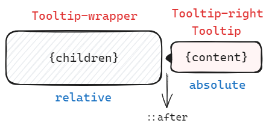

## Tooltip 文字提示
+ 使用 React 中的 `FC<PropsWithChildren<TooltipProps>>` 构建组件基本结构，表示它是一个 React 函数组件，接受的属性包括 TooltipProps 中定义的属性，以及一个可选的 `children` 属性，确保属性类型安全。
+ 组件接收一个位置参数 `position` 设置表示位置的类名，例如 `hara-tooltip-left` 来处理不同方向下组件的样式。
+ 使用 `useState` 钩子监视 `visible` 来管理显示和隐藏的状态，通过 ` onMouseEnter ` 和 ` onMouseLeave ` 鼠标进入和离开的事件处理函数：进入时 `setVisible(true)` / ... 然后根据 visible 的值进行条件渲染判断显示和隐藏


## Select 选择器
因为不只是使用一个组件就可以完成的，所以使用多组件的结构来搓
```html
<Select>
	<SelectTrigger></SelectTrigger>
	<SelectContent>
	    <SelectItem></SelectItem>
	</SelectContent>
</Select>
```
SelectTrigger 用来存放点击触发器中的内容如“选择一个选项”，SelectContent 用来存放各个选项即 SelectItem ，其中通过上下文（`Context`）来管理状态和交互。

其中上下文结构由 `SelectContextProps` 定义，包括是否打开下拉菜单、选中标签和值、切换菜单的打开状态以及选择选项时的回调：
```js
const SelectContext = createContext<SelectContextProps|undefined>(undefined)
```
### SelectTrigger
`SelectTrigger` 组件是下拉菜单的触发器按钮，它使用 `useContext` 来获取上下文，并根据菜单的状态应用不同的样式（选中或者未选中），点击触发器按钮时触发上下文的 `toggleOpen` 函数切换菜单状态，如果后边 **选择了选项则会展示选项内容（组件重新渲染了**

会重新渲染的原因：
选择选项触发的 `onSelect` 中有 `setSelectedValue` 等更新状态的函数，主组件 Select 的状态发生变化的话就会重新渲染真个组件结构包括 trigger ~
### SelectContent
`SelectContent` 组件用于显示下拉菜单的内容，获取上下文根据其中的菜单状态选择是否展示选项
### SelectItem
`SelectItem` 组件表示下拉菜单中的一个选项，获取上下文根据选项是否被选中展示不同的样式（勾勾）点击选项时触发上下文的 `onSelect` 选择该选项，并根据使用 `Select` 组件时是否定义了 `onChange` 来处理选择的选项内容~
